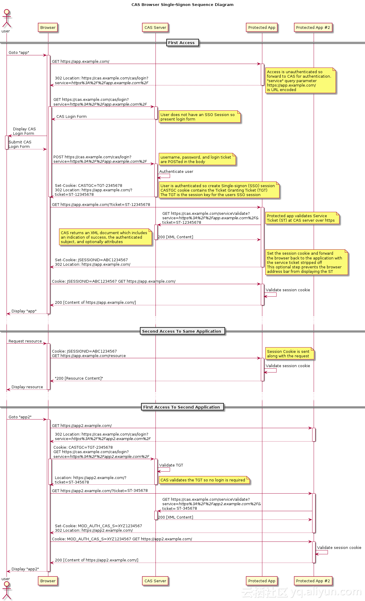

# sso 单点登录简单实现
## 模块划分
* server-api：api接口模块
* server-sso：sso系统，即登录系统 www.sso.com
* server-web1：web1系统 www.web1.com
* server-web2：web2系统 www.web2.com
## 实现逻辑

1.用户访问web1系统获取资源，但是web1是要先登录的
2.跳转到sso系统登录，输入账户信息成功登录后，生成一个sso域下的session，并返回一个token
3.再跳转回web1系统，并携带token给web1系统，web1系统拿到token后会拿它去sso系统验证，看这个token是否有效
4.验证通过后，web1系统将登录状态写入session，并返回资源
5.此后用户在访问web1系统，就可以根据web1域下的session来获取资源
******
访问另一个系统web2
1.用户访问web2系统获取资源
2.跳转到sso系统登录，因为刚刚已经登陆过有session，所以根据session返回token
3.再跳转回web2系统，并携带token给web2系统，web2系统拿到token后会拿它去sso系统验证，看这个token是否有效
4.验证通过后，web2系统将登录状态写入session，并返回资源
5.此后用户在访问web2系统，就可以根据web1域下的session来获取资源

